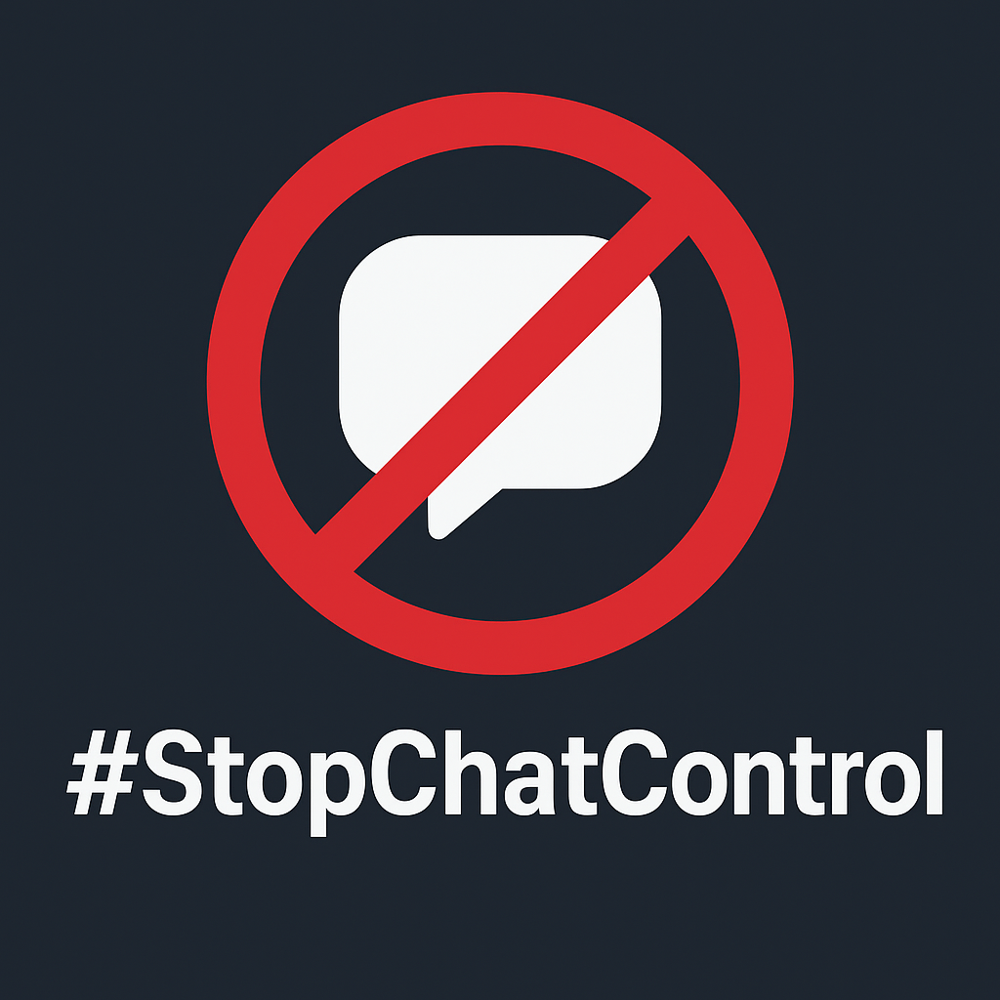

# 🚫 #StopChatControl — Protect Your Privacy

---

## 🖥️ Live Demo

[View the page live](https://zvspany.github.io/stopchatcontrol/)

---

## 🌐 Overview
**#StopChatControl** warns about the EU's controversial "Chat Control" proposal.  
It threatens the **privacy** and **freedom of speech** of all EU citizens by proposing mandatory scanning of all messages and images, including encrypted communication.

We aim to **inform**, **educate**, and **mobilize action** to protect digital rights.

---

## ✨ Features
- 🕒 **Interactive Timeline** of key events from 2020 → 2025
- 💡 **Technical breakdown**: server-side scanning, client-side scanning, metadata analysis
- ❓ **FAQ & Sources** with official references
- 📱 **Responsive design** for all devices
- 🌍 Dual-language support: English (`index.html`) and Polish (`indexpolish.html`)
- 🔒 **Backdoor panel** explaining security risks

---

## ⚠️ Why This Matters
- Mass surveillance threatens **privacy**, **security**, and **fundamental EU rights**.
- Weakening end-to-end encryption exposes everyone — including financial, medical, and private data — to hackers.
- Automatic scanning risks **false positives**, potentially targeting innocent people.

---

## 🛠 How It Works
- Built with **HTML5**, **CSS3**, and vanilla **JavaScript**.
- Smooth scrolling navigation & interactive elements.
- Fully **static site** — no backend required.
- Language toggle buttons for **English ↔ Polish**.

---

## 🌍 Languages
- 🇬🇧 English: [`index.html`](index.html)  
- 🇵🇱 Polish: [`indexpolish.html`](indexpolish.html)

Click the **language button** on the site to switch versions.

---

## 📚 Sources & References
- [Official EU Documents – EUR-Lex](https://eur-lex.europa.eu/)  
- [Data Protection Incidents 2022 – ZFODO](https://gdpr.pl/)  
- [Polish Internet Security Analysis 2024 – CERT Polska](https://www.cert.pl/)

---

## 🚀 How to Use
1. Open `index.html` or `indexpolish.html` in any modern browser.  
2. Navigate sections with **smooth scrolling**.  
3. Click the **language button** to switch English ↔ Polish.

---

## 🤝 Contributing
We welcome contributions!  
- Improve UI/UX  
- Add references or translations  
- Report issues or send pull requests  

---

## 📝 License
**MIT License** — free to use, modify, and share responsibly.

---

> Protect your privacy. Stand against mass surveillance. **#StopChatControl**
